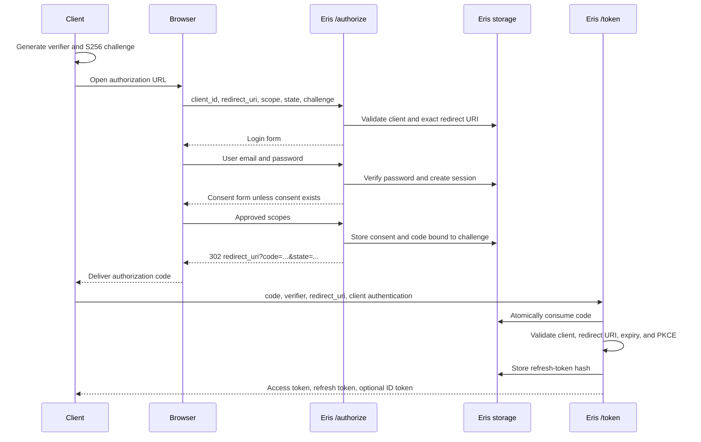
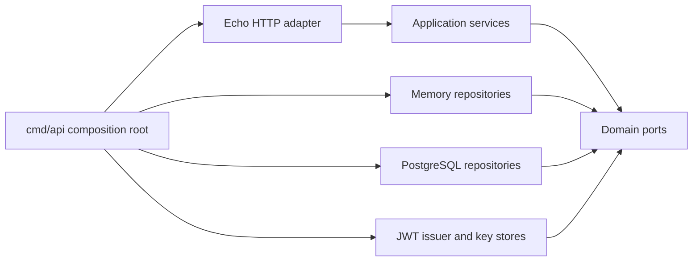

# Eris OAuth 2.0 Server

Eris is a small OAuth 2.0 and OpenID Connect authorization server written in Go. It implements the Authorization Code flow with PKCE (`S256`), browser login and consent, signed JWT access and ID tokens, and rotating refresh tokens.

This repository is designed as a readable implementation of the protocol. It is not yet a production-ready identity provider; see [Current limitations](#current-limitations).

## OAuth in plain language

OAuth lets a user authorize one application to access another service without giving the application their password.

For example, a reporting application may need access to a user's account. The reporting application should not collect the user's Eris password. Instead:

1. The application sends the user's browser to Eris.
2. Eris authenticates the user and asks for consent.
3. Eris sends the application a short-lived authorization code.
4. The application exchanges that code for tokens directly with Eris.
5. The application uses the access token when calling an API.

The user's password is entered only at Eris. The client application receives tokens with limited scope instead of the password.

### The actors

| OAuth role | In this project | Responsibility |
| --- | --- | --- |
| Resource owner | Alice or Bob | Owns the account and grants access |
| Client | `spa-client` or a registered app | Requests access on the user's behalf |
| Authorization server | Eris | Authenticates, records consent, and issues tokens |
| Resource server | A future API | Accepts and validates access tokens |
| User agent | Browser | Moves the user through login, consent, and redirects |

OAuth provides delegated authorization. OpenID Connect builds identity on top of OAuth. When the client requests the `openid` scope, Eris also returns an ID token that tells the client who authenticated.

## Why use an authorization code?

Eris does not return access or refresh tokens through the browser redirect. URLs can leak into browser history, logs, analytics, screenshots, and referrer headers. Instead, the redirect carries a short-lived, single-use code.

The client exchanges that code at `/token`. This separates the browser-facing authorization step from token issuance, but a stolen code could still be valuable. PKCE addresses that remaining risk.

## Why PKCE is needed

PKCE means Proof Key for Code Exchange. Before starting authorization, the client creates a random secret called the `code_verifier`. It keeps that value locally and sends only a derived challenge to `/authorize`:

```text
code_challenge = BASE64URL_NO_PADDING(SHA256(code_verifier))
```

Eris stores the challenge with the authorization code. During the `/token` exchange, the client sends the original verifier. Eris hashes it and compares the result with the stored challenge.

An attacker who intercepts only the authorization code cannot redeem it without the verifier. Eris requires `S256`; it rejects the weaker `plain` method.

PKCE and client secrets solve different problems:

| Mechanism | What it proves |
| --- | --- |
| PKCE verifier | The token request came from the client instance that started this authorization request |
| Client secret | The caller knows a credential assigned to a confidential client |

Public browser and mobile clients cannot safely keep a permanent secret, so they rely on PKCE. Confidential server-side clients use a client secret and PKCE in this implementation.

## Values in the flow

| Value | Purpose | Exposure |
| --- | --- | --- |
| `code_verifier` | Secret proof for this authorization attempt | Held by the client, then sent only to `/token` |
| `code_challenge` | SHA-256 commitment to the verifier | Sent through the browser and stored with the code |
| `state` | Correlates the redirect with the request and helps the client prevent login CSRF | Sent to Eris and returned unchanged; the client must validate it |
| Authorization code | Short-lived, single-use exchange credential | Returned through the browser redirect |
| Eris session cookie | Proves the user logged in to Eris | Browser and Eris only |
| Access token | Bearer credential for an API | Returned by `/token`; must be protected by the client |
| Refresh token | Credential for obtaining a new token set | Returned once; Eris stores only its hash |
| ID token | Signed identity statement for the client | Returned when `openid` is granted |

## Complete PKCE flow



### 1. Client creates the PKCE pair

The client generates a high-entropy verifier and its `S256` challenge. The verifier never enters the browser authorization request.

### 2. Browser calls `GET /authorize`

```http
GET /authorize?client_id=spa-client
  &redirect_uri=http://localhost:3000/callback
  &scope=openid%20profile
  &state=xyz123
  &code_challenge=<challenge>
  &code_challenge_method=S256
```

`AuthorizeHandler.Start` converts HTTP parameters into `domain.AuthorizeRequest`. `authorizeService.Authorize` then checks:

1. The client exists.
2. `redirect_uri` exactly matches a registered URI.
3. Every requested scope is allowed for the client.
4. A challenge is present and its method is `S256`.
5. A valid Eris login session exists.
6. Existing consent covers every requested scope.

The exact redirect comparison prevents an attacker from substituting a lookalike or attacker-controlled callback. Eris does not redirect errors until the client and redirect URI have been trusted.

### 3. User logs in at `POST /authorize/login`

The browser posts the user's credentials to Eris, not to the client. The service loads the user, requires an active account, and verifies the bcrypt password hash. It creates a random session with a 24-hour expiry.

The `eris_session` cookie is `HttpOnly`, `Secure`, and `SameSite=Lax`. It authenticates the browser to Eris; it is not an OAuth access token.

### 4. User grants consent at `POST /authorize/consent`

Eris stores the approved scopes for the user/client pair, then creates an opaque authorization code. The stored record binds together:

```go
domain.AuthorizationCode{
    Code:                code,
    UserID:              userID,
    ClientID:            req.ClientID,
    RedirectURI:         req.RedirectURI,
    Scopes:              req.Scopes,
    CodeChallenge:       req.CodeChallenge,
    CodeChallengeMethod: req.CodeChallengeMethod,
    ExpiresAt:           time.Now().Add(90 * time.Second),
}
```

If valid consent already exists, Eris can issue the code immediately after login. It redirects only to the exact registered callback and returns `state` unchanged:

```text
http://localhost:3000/callback?code=<code>&state=xyz123
```

### 5. Client exchanges the code at `POST /token`

```bash
curl -X POST http://localhost:8080/token \
  --data-urlencode 'grant_type=authorization_code' \
  --data-urlencode 'code=<authorization-code>' \
  --data-urlencode 'redirect_uri=http://localhost:3000/callback' \
  --data-urlencode 'code_verifier=<original-verifier>' \
  --data-urlencode 'client_id=spa-client'
```

The token service:

1. Loads the client and verifies its secret when it is confidential.
2. Atomically consumes the authorization code.
3. Requires the code to belong to this client.
4. Requires the same exact redirect URI used during authorization.
5. Rejects expired or previously consumed codes.
6. Computes `S256(code_verifier)` and compares it in constant time.
7. Issues tokens only after every check succeeds.

Any missing, expired, reused, or PKCE-invalid code produces `invalid_grant`.

## How the endpoints are protected

| Endpoint | Important checks | Threat reduced |
| --- | --- | --- |
| `GET /authorize` | Registered client, exact redirect URI, scope allow-list, mandatory S256 challenge | Open redirects, unauthorized scopes, requests without PKCE |
| `POST /authorize/login` | Bcrypt password check, active account, random session ID, protected cookie | Password disclosure to clients, session guessing |
| `POST /authorize/consent` | Valid Eris session and persisted user approval | Issuing a code without an authenticated user |
| `POST /token` with code | Client authentication, atomic code use, expiry, client/redirect binding, constant-time PKCE check | Code interception, replay, client and redirect substitution |
| `POST /token` with refresh token | Hash lookup, client ownership, expiry, revocation, rotation | Database disclosure of raw tokens and simple replay |

### Atomic authorization-code consumption

A code must never succeed twice, including when two requests arrive at the same moment. The memory adapter holds a mutex while checking and marking the code consumed. PostgreSQL uses one conditional statement:

```sql
UPDATE authorization_codes
SET consumed_at = $2
WHERE code = $1 AND consumed_at IS NULL
RETURNING ...;
```

Only one concurrent request can return the row. This avoids the replay race created by a separate read followed by an update.

### Refresh-token rotation

Eris returns a random opaque refresh token but persists only its SHA-256 hash. On refresh, it verifies ownership and expiry, revokes the old token, and issues a new pair. The old raw token then returns `invalid_grant`.

### Signed tokens and keys

Access and ID tokens are signed with RS256. The JWT header contains the active key ID (`kid`). Access tokens last 15 minutes and include `iss`, `sub`, `aud`, `scope`, `iat`, and `exp` claims.

The memory key store retains its RSA key only for the process lifetime. The PostgreSQL key store loads the same active key after restart. Private keys are stored unencrypted in this development implementation.

## Run Eris locally

Requirements:

- Go `1.27.1`, or a compatible toolchain
- Docker for PostgreSQL and migrations
- `curl`, `openssl`, and `python3` for the end-to-end script

```bash
cp -n .env.example .env
```

Eris loads `.env` with Zenith. Exported environment variables override file values.

### PostgreSQL mode

```bash
./scripts/migrate.sh up
go run ./cmd/api
```

Check the server and open a database session:

```bash
curl http://localhost:8080/healthz
./scripts/connect-postgres.sh
```

### Memory mode

Memory mode needs no database and recreates seeded data at each start:

```bash
STORAGE_BACKEND=memory go run ./cmd/api
```

## Run the PKCE test

With Eris already listening on port `8080`, run:

```bash
bash scripts/eris-authcode-pkce-test.sh
```

The script covers the successful flow plus code replay, wrong-verifier, refresh rotation, and old-refresh-token rejection. It supports both a new consent and consent persisted by an earlier PostgreSQL run.

The seeded `spa-client` is public and needs no secret. To test a confidential client:

```bash
CLIENT_ID='your-client-id' \
CLIENT_SECRET='the-raw-secret' \
REDIRECT_URI='http://localhost:3000/callback' \
bash scripts/eris-authcode-pkce-test.sh
```

The value stored in PostgreSQL is a bcrypt hash beginning with `$2a$`; it is not the raw secret and cannot be used to authenticate.

## Development data

| Client ID | Type | Redirect URI | Scopes |
| --- | --- | --- | --- |
| `spa-client` | Public | `http://localhost:3000/callback` | `openid profile email` |

| Email | Password |
| --- | --- |
| `alice@example.com` | `correct-horse` |
| `bob@example.com` | `battery-staple` |

Passwords are stored as bcrypt hashes.

## Register a confidential client

Run interactively:

```bash
./scripts/create-client.sh
```

Or provide flags:

```bash
./scripts/create-client.sh \
  -name 'Example server app' \
  -redirect-uri 'http://localhost:3000/callback' \
  -scope 'openid,profile,email'
```

The command generates a random ID and secret, stores only the bcrypt hash, and prints the raw secret once. Keep that output secure; a bcrypt hash cannot be reversed to recover it.

## Manage migrations

```bash
./scripts/migrate.sh up              # apply all pending migrations
./scripts/migrate.sh up 1            # apply one migration
./scripts/migrate.sh version         # show current version
./scripts/migrate.sh down             # roll back one migration
./scripts/migrate.sh down 2           # roll back two migrations
./scripts/migrate.sh goto 7           # move to a specific version
./scripts/migrate.sh create add_field # create an up/down pair
```

Every schema change needs matching `.up.sql` and `.down.sql` files. Do not edit a migration after it has been applied to a shared database; add a new one. `force` changes only migration metadata and should be used only after manually repairing a failed migration.

## Implementation map

Eris uses ports and adapters:



| Folder | Responsibility |
| --- | --- |
| `cmd/api` | Loads configuration and wires concrete adapters |
| `cmd/client` | Registers confidential clients |
| `internal/domain` | Entities, errors, and interfaces; no HTTP or database dependencies |
| `internal/application` | Authorization, login, consent, code exchange, and refresh rules |
| `internal/adapter/http` | Echo routes and OAuth HTTP responses |
| `internal/adapter/repository/memory` | Process-local persistence |
| `internal/adapter/repository/postgres` | `pgx` persistence |
| `internal/adapter/crypto` | RSA key stores and JWT issuance |
| `internal/config` | Zenith-backed `.env` loading and validation |
| `migrations` | Versioned PostgreSQL schema and seed changes |
| `scripts` | Database, migration, client-registration, and PKCE helpers |

Application services depend on interfaces in `internal/domain/ports.go`. Switching from memory to PostgreSQL changes adapters in `cmd/api/main.go`; it does not change OAuth rules or HTTP handlers.

## Error model

Application code returns typed domain errors. The HTTP adapter translates them to OAuth responses:

| Domain error | OAuth error | HTTP status |
| --- | --- | --- |
| `InvalidClientError` | `invalid_client` | `401` |
| `InvalidGrantError` | `invalid_grant` | `400` |
| `PKCEMismatchError` | `invalid_grant` | `400` |
| Unexpected error | `server_error` | `500` |

This keeps protocol and transport formatting out of the domain and application layers.

## Current limitations

- There is no discovery document or JWKS endpoint.
- Signing-key rotation and encryption at rest are not implemented.
- The inline login and consent forms do not use HTML templates with escaping.
- Login and consent form POSTs do not have dedicated CSRF tokens. OAuth `state` protects the client's redirect flow, not Eris forms.
- The consent POST trusts hidden authorization fields and does not fully revalidate all request values or the approved-scope subset.
- The session cookie is `Secure`; local browser testing over plain HTTP may require local TLS or a development-only cookie option.
- Grant-type allow-lists are stored but not enforced by application services.
- PKCE verifier syntax and length are not explicitly validated.
- ID-token `nonce` is not connected to the authorization request.
- Refresh revoke-and-issue is not one database transaction, and token-family reuse detection is not implemented.
- Expired records are not cleaned up automatically.
- Memory state and keys disappear at restart and cannot support replicas.
- Service and HTTP-handler unit coverage is incomplete; the shell script is the primary end-to-end test.

These limitations are implementation gaps, not weaknesses in Authorization Code + PKCE itself.
